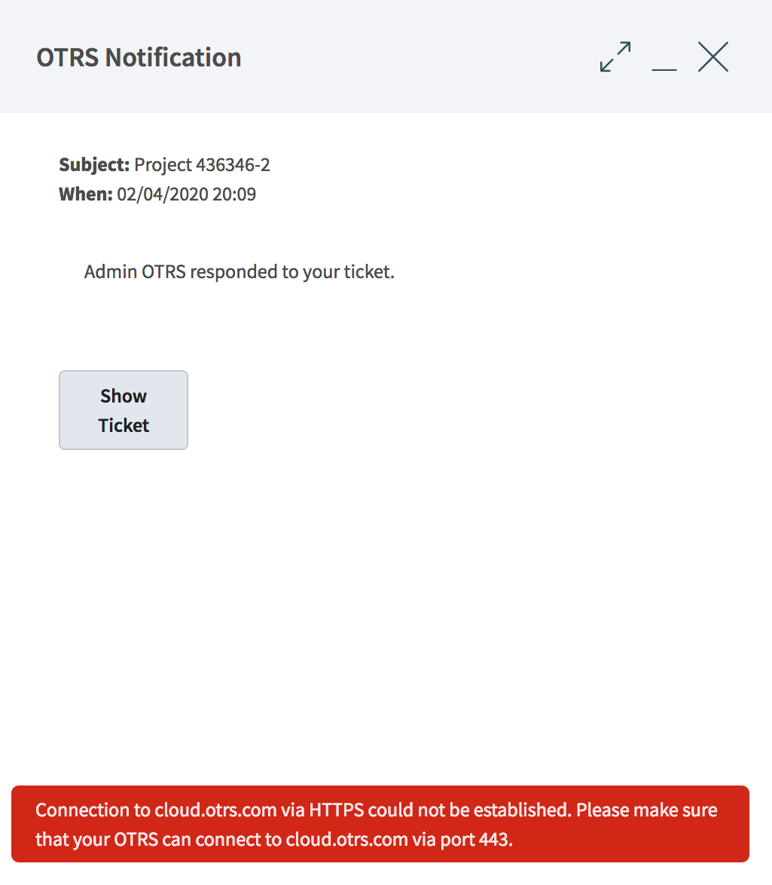

Business Object Detail Views
============================

Ticket Detail View
------------------

Sidebar
~~~~~~~

   Sidebar

.. _ticket-detail-widgets:

Ticket Detail View Widgets
~~~~~~~~~~~~~~~~~~~~~~~~~~

Communication Compact Widget
  This widget shows all articles of the ticket in a table.

  This widget supports :ref:`widget-filter` and :ref:`widget-configuration`.

  .. figure:: images/bodv-ticket-communication-compact.png
     :alt: Communication Compact Widget

     Communication Compact Widget

  Articles in the communication of a ticket can come from different channels. The column *Channel* informs about the channel of the according article.
  The column with the arrows on both sides informs about the direction of the article. Possible values are here:

  - Incomming
  - Outgoing
  - System

  The column with the information symbol shows additional article information e.g. if the article is marked as important.

  Clicking an article in the table expands the article. Clicking the *Expand all* button at the top of the widget expands all articles.

  .. figure:: images/bodv-ticket-communication-compact-expanded.png
     :alt: Communication Compact Widget Expanded Article

     Communication Compact Widget Expanded Article

  The icons at the article in the expanded view allow actions like reply or forward. The article menu symbol opens further actions e.g. printing the article or splitting the article.

Communication Stream Widget
  This widget shows the articles of a ticket in a different form than in the widget *Communication Compact*. The articles are displayed as symbolic speech bubbles next to the authors' avatars with the topic and the abbreviated content of the article.

  This widget supports :ref:`widget-filter` and :ref:`widget-configuration`.

  .. figure:: images/bodv-ticket-communication-stream.png
     :alt: Communication Stream Widget

     Communication Stream Widget

  The article direction is represented by the avatars of each side. The left side avatars represent the incomming articles. The avatars at the right side represent the outgoing articles. The symbols near the avatars represent the channel of the article.

  Clicking an article expands the article. The icons at the article in the expanded view allow actions like reply or forward. The article menu symbol opens further actions e.g. printing the article or splitting the article.

Properties Widget
  This widget shows the properties of the ticket. The properties are presented as small cards within the widget.

  This widget supports :ref:`widget-configuration`.

  .. figure:: images/bodv-ticket-properties.png
     :alt: Properties Widget

     Properties Widget

  Most of the cards have a pen symbol in the right corner. Clicking this symbol allows to directly edit the property.

Linked Tickets Widget
  This widget shows linked tickets presented in a list.

  This widget supports :ref:`widget-filter` and :ref:`widget-configuration`.

  .. figure:: images/bodv-ticket-linked-tickets.png
     :alt: Linked Tickets Widget

     Linked Tickets Widget

  The *Unlink* column allows to directly unlink a ticket.

Customer Information Widget
  This widget shows information about customer and customer users presented in cards.

  This widget supports :ref:`widget-configuration`.

  .. figure:: images/create-request-customer-information.png
     :alt: Customer Information Widget

     Customer Information Widget

  The customer card shows the number of open and closed tickets of the customer. The *Action* section contains icons to directly edit the customer. The section *Social* contains links to the social channels of the customer.

  The customer user card shows the number of open and closed tickets of the customer user. The *Create* section contains icons to directly create a new customer user. The *Action* section contains icons to directly edit the customer user and to login as customer user. The section *Social* contains links to the social channels of the customer user.

Attachments Widget
  TODO

Linked Knowledge Base Articles Widget
  This widget shows linked knowledge base articles.

  This widget supports :ref:`widget-filter` and :ref:`widget-configuration`.

  .. figure:: images/bodv-ticket-linked-kba.png
     :alt: Linked Knowledge Base Articles Widget

     Linked Knowledge Base Articles Widget

  The *Unlink* column allows to directly unlink a ticket.

Drafts
  This widget shows all defined drafts in a list. Clicking on an item in the list opens the according draft.

  This widget supports :ref:`widget-configuration`.

  .. figure:: images/bodv-ticket-drafts.png
     :alt: Drafts Widget

     Drafts Widget

  The *Delete* column allows to directly delete a draft.

Ticket Detail View Actions
~~~~~~~~~~~~~~~~~~~~~~~~~~

Note
  This ticket action allows to create a note for ticket. Notes are by default only shown to agents. The note is added as article to the ticket.

  .. figure:: images/bodv-ticket-action-note.png
     :alt: Ticket Action Note

     Ticket Action Note

  If the checkbox *Is visible for customer* is checked the note will be visible for customers in the external interface.

  The fields *Subject* and *Body* are mandatory. The field *Attachments* allows to add attachments to the note. The field *Time Units* can be used to input times.

  If the checkbox *Mark as important* is checked the note will be marked as important. The note will be shown in the *Communication Compact* widget with a special icon showing that this article is important.

Phone Call Outbound
  This ticket action allows to add a note to the ticket based on an outgoing phone call.

  .. figure:: images/bodv-ticket-action-phone-outbound.png
     :alt: Ticket Action Phone Outbound

     Ticket Action Phone Outbound

Phone Call Inbound
  This ticket action allows to add a note to the ticket based on an incoming phone call.

  .. figure:: images/bodv-ticket-action-phone-inbound.png
     :alt: Ticket Action Phone Inbound

     Ticket Action Phone Inbound

E-Mail Outbound
  This ticket action allows to send an email and add the email as article to the ticket.

  .. figure:: images/bodv-ticket-action-email-outbound.png
     :alt: Ticket Action E-mail Outbound

     Ticket Action E-mail Outbound

  SMS Outbound
    This ticket action allows to send an SMS and add the SMS as article to the ticket.

  .. figure:: images/bodv-ticket-action-sms-outbound.png
     :alt: Ticket Action SMS Outbound

     Ticket Action SMS Outbound

Free Fields
  This ticket action allows to change the free field values of the ticket.

  .. figure:: images/bodv-ticket-action-free-fields.png
     :alt: Ticket Action Free Fields

     Ticket Action Free Fields

Print
  This ticket action allows to print the ticket.

Close
  This ticket action allows to close the ticket.

  .. figure:: images/bodv-ticket-action-close.png
     :alt: Ticket Action Close

     Ticket Action Close

Link
  This ticket action allows to link the ticket with other tickets or knowledge base articles.

  .. figure:: images/bodv-ticket-action-link.png
     :alt: Ticket Action Link

     Ticket Action Link

  The filter sections allows to filter for tickets or knowledge base articles. For tickets the filters *Number* and *Title* are set as default filter fields. For knowledge base articles the filters *Category* and *Knowledge base article number* are set as default filters.

  This section has the same function as the filter sections for business object list and allows defining more filters and save these as filter presets.

  The objects can be linked as *Normal* , *Child* or *Parent*.

Pending
  This ticket action allows to set a pending reminder or a pending auto close for the ticket.

  .. figure:: images/bodv-ticket-action-pending.png
     :alt: Ticket Action Pending

     Ticket Action Pending

Priority
  This ticket action allows to change the priority of the ticket.

  .. figure:: images/bodv-ticket-action-priority.png
     :alt: Ticket Action Priority

     Ticket Action Priority

Owner
  This ticket action allows to change the owner of the ticket.

  .. figure:: images/bodv-ticket-action-owner.png
     :alt: Ticket Action Owner

     Ticket Action Owner

History
  This ticket action allows to view the history of the ticket.

  .. figure:: images/bodv-ticket-action-history.png
     :alt: Ticket Action History

     Ticket Action History

Article Actions
~~~~~~~~~~~~~~~

Reply
  This article action allows to reply to the article. If the checkbox *Is visible for customer* is checked the article will be visible for customers in the external interface.

  The fields *Subject* and *Body* are mandatory. The field *Attachments* allows to add attachments to the note. The field *Time Units* can be used to input times.

  If the checkbox *Mark as important* is checked the note will be marked as important.

Reply all
  This article action allows to reply all recipients to the article. If the checkbox *Is visible for customer* is checked the article will be visible for customers in the external interface.

  The fields *Subject* and *Body* are mandatory. The field *Attachments* allows to add attachments to the note. The field *Time Units* can be used to input times.

  If the checkbox *Mark as important* is checked the note will be marked as important.

Reply via SMS
  This article action allows to reply to the article as SMS message. If the checkbox *Is visible for customer* is checked the article will be visible for customers in the external interface.

  The fields *Subject* and *Body* are mandatory. The field *Attachments* allows to add attachments to the note. The field *Time Units* can be used to input times.

  The checkbox *Flash message* can be used to display the sms directly and without user interaction. (depends on the used device and provider)

  If the checkbox *Mark as important* is checked the note will be marked as important.

Forward
  This article action allows to forward the article as email. If the checkbox *Is visible for customer* is checked the article will be visible for customers in the external interface.

  The fields *Subject* and *Body* are mandatory. The field *Attachments* allows to add attachments to the note. The field *Time Units* can be used to input times.

  If the checkbox *Mark as important* is checked the note will be marked as important.

Redirect
  This article action allows to redirect the article as email. The checkbox *Inform original sender* is checked by default.

  The fields *Subject* and *Body* are mandatory.

Mark as Important
  This article action marks the article as important. Articles marked as important are highlighted in the article overviews.

Split
  This article action allows to split the article to an other ticket. Possible link type are:

  - Parent
  - Child
  - Normal

Print
  This article action allows to print the article.

Knowledge Base Article Detail View
----------------------------------

Knowledge Base Article Detail View Widgets
~~~~~~~~~~~~~~~~~~~~~~~~~~~~~~~~~~~~~~~~~~

Symptom (public) Widget
  This widget can be used to describe the symptom of a problem.

  .. figure:: images/bodv-kba-symptom.png
     :alt: Symptom Widget

     Symptom Widget

  This widget supports :ref:`widget-configuration`.

Problem (public) Widget
  This widget can be used to describe the problem itself.

  .. figure:: images/bodv-kba-problem.png
     :alt: Problem Widget

     Problem Widget

  This widget supports :ref:`widget-configuration`.

Solution (public) Widget
  This widget can be used to describe the solution of the problem.

  .. figure:: images/bodv-kba-solution.png
     :alt: Solution Widget

     Solution Widget

  This widget supports :ref:`widget-configuration`.

Comment (internal) Widget
  This widget can be used to add a comment to the article. The comment is not shown in the external interface.

  .. figure:: images/bodv-kba-comment.png
     :alt: Comment Widget

     Comment Widget

  This widget supports :ref:`widget-configuration`.

Rating Widget
  This widget can be used to rate the knowledge base article.

  .. figure:: images/bodv-kba-rating.png
     :alt: Rating Widget

     Rating Widget

  This widget supports :ref:`widget-configuration`.

Properties Widget
  This widget shows the properties of the knowledge base article. The properties are presented as small cards within the widget.

  This widget supports :ref:`widget-configuration`.

  .. figure:: images/bodv-kba-properties.png
     :alt: Properties Widget

     Properties Widget

  Most of the cards have a pen symbol in the right corner. Clicking this symbol allows to directly edit the property.

Attachments Widget

  .. figure:: images/bodv-kba-attachments.png
     :alt: Attachments Widget

     Attachments Widget

Linked Tickets Widget
  This widget shows linked tickets.

  This widget supports :ref:`widget-filter` and :ref:`widget-configuration`.

Knowledge Base Article Detail View Actions
~~~~~~~~~~~~~~~~~~~~~~~~~~~~~~~~~~~~~~~~~~

Edit
  This knowledge base article action allows to edit the knowledge base article.

  .. figure:: images/bodv-kba-action-edit-article.png
     :alt: Edit Article Widget

     Edit Article Widget

Link
  This knowledge base article action allows to link the knowledge base article.

  .. figure:: images/bodv-kba-action-add-links.png
     :alt: Add Links Widget

     Add Links Widget

Delete
  This knowledge base article action allows to delete the knowledge base article.

History
  .. figure:: images/bodv-kba-action-history.png
     :alt: History Widget

     History Widget

Print
  This knowledge base article action allows to print the knowledge base article.

Customer Detail View
--------------------

Customer Detail View Widgets
~~~~~~~~~~~~~~~~~~~~~~~~~~~~

Customer Information Widget
  This widget shows information about the customer presented in a card.

  .. figure:: images/bodv-customer-user-customer-information.png
     :alt: Customer Information Widget

     Customer Information Widget

  The customer card shows the number of open and closed tickets of the customer. The *Action* section contains icons to directly edit the customer. The section *Social* contains links to the social channels of the customer.

Customer User List Widget
  .. figure:: images/bodv-customer-user-customer-list.png
     :alt: Customer User List Widget

     Customer User List Widget

Reminder Tickets Widget
  This widget lists the pending tickets. Pending tickets are set for later work by the agent, and the reminder time is going to expire soon.

  .. figure:: images/bodv-customer-user-reminder-tickets.png
     :alt: Reminder Tickets Widget

     Reminder Tickets Widget

This widget supports :ref:`widget-filter` and :ref:`widget-configuration`.

Escalated Tickets Widget
  This widget lists the escalated tickets. Escalated tickets are after the time set in service level agreement, and therefore needs to be worked on them immediately.

This widget supports :ref:`widget-filter` and :ref:`widget-configuration`.

Open Tickets Widget
  This widget lists the open tickets. Open tickets represent the current work done by the agent.

  .. figure:: images/bodv-customer-user-open-tickets.png
     :alt: Open Tickets Widget

     Open Tickets Widget

This widget supports :ref:`widget-filter` and :ref:`widget-configuration`.

New Tickets Widget
  This widget lists the new tickets. New tickets are created by customer users, and no agent is started to work on them at the moment.

  .. figure:: images/bodv-customer-user-new-tickets.png
     :alt: New Tickets Widget

     New Tickets Widget

This widget supports :ref:`widget-filter` and :ref:`widget-configuration`.

Customer User Detail View
-------------------------

Customer User Detail View Widgets
~~~~~~~~~~~~~~~~~~~~~~~~~~~~~~~~~

Customer Information Widget
  This widget shows information about the customer user presented in a card.

  .. figure:: images/bodv-customer-user-customer-information.png
     :alt: Customer Information Widget

     Customer Information Widget

  The customer user card shows the number of open and closed tickets of the customer. The *Create* section contains icons to directly create a new customer user. The *Action* section contains icons to directly edit the customer user and to login as customer user. The section *Social* contains links to the social channels of the customer user.

Customer User List Widget
  TODO

Reminder Tickets Widget
  This widget lists the pending tickets. Pending tickets are set for later work by the agent, and the reminder time is going to expire soon.

  .. figure:: images/bodv-customer-user-reminder-tickets.png
     :alt: Reminder Tickets Widget

     Reminder Tickets Widget

This widget supports :ref:`widget-filter` and :ref:`widget-configuration`.

Escalated Tickets Widget
  This widget lists the escalated tickets. Escalated tickets are after the time set in service level agreement, and therefore needs to be worked on them immediately.

Open Tickets Widget
  This widget lists the open tickets. Open tickets represent the current work done by the agent.

  .. figure:: images/bodv-customer-user-open-tickets.png
     :alt: Open Tickets Widget

     Open Tickets Widget

This widget supports :ref:`widget-filter` and :ref:`widget-configuration`.

New Tickets Widget
  This widget lists the new tickets. New tickets are created by customer users, and no agent is started to work on them at the moment.

  .. figure:: images/bodv-customer-user-new-tickets.png
     :alt: New Tickets Widget

     New Tickets Widget

This widget supports :ref:`widget-filter` and :ref:`widget-configuration`.

Notification Detail View
------------------------

   Notification Detial View
