Business Object Lists
=====================

The business object list displays a configured set of data from business objects.

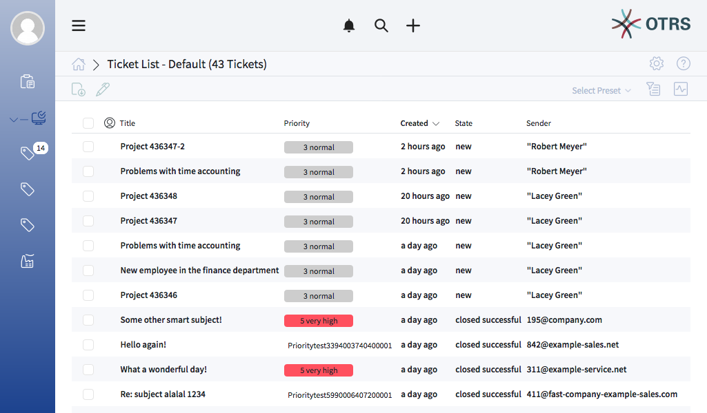

   Business Object List Example

If there are more items, a note at the end of the list informs about how many more items there are that cannot yet be displayed. Scrolling down the business object lists loads automatically more items until the end of the list is reached. The visible size of the list is remembered for reloads and navigation.

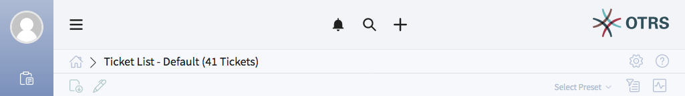

   Header Area

The page breadcrumb indicates the total number of found business objects depending on the filter criteria for the business object list.

Business object lists periodically check on the server side for data updates. The refresh interval time can be globally adjusted by the system administrator.

Data updates for an item displayed in a business object list are applied immediately. The row associated with the element is highlighted in color for a short time to indicate a change. If the data updates update an item so that it can no longer be displayed in the current list, the corresponding item is highlighted in red and after a few seconds is removed from this list and no longer displayed.

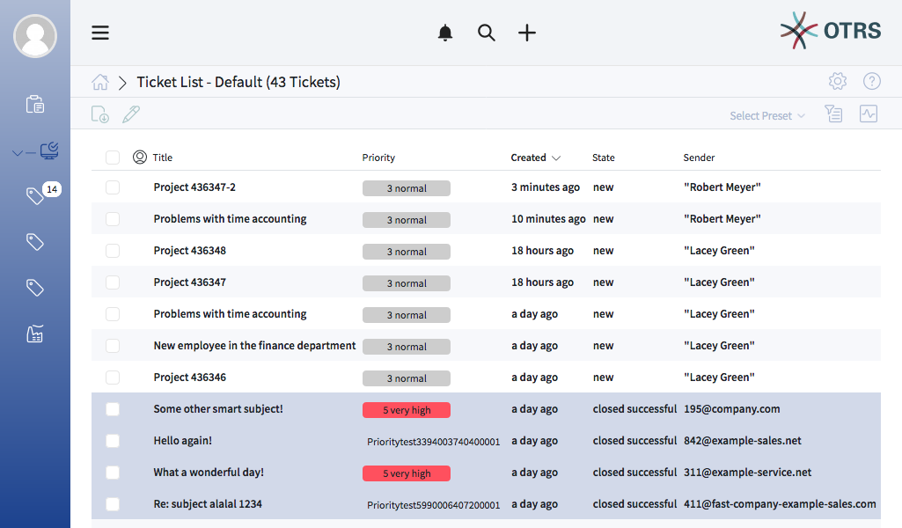

   Highlighting on Data Change

Clicking on a item in the business object list opens the detail view of the item. The detail view remembers the context of the business object list. If you go back to a Business Object List from a detail view, the Business Object List is opened again and the element is highlighted in color. (if it still exists on the screen).

Business object lists have a screen configuration and a non-permanent configuration that can be set by using the filter functions. The screen configuration of a business object list can be configured using the cog wheel icon in the upper right corner.

The non-permanent screen configuration is never saved and synchronized, but allows the saving of named filter presets.

List Actions
------------

List Previews
~~~~~~~~~~~~~

Hovering with the mouse over an business object symbol in the left sidebar opens a preview of the according business object list.

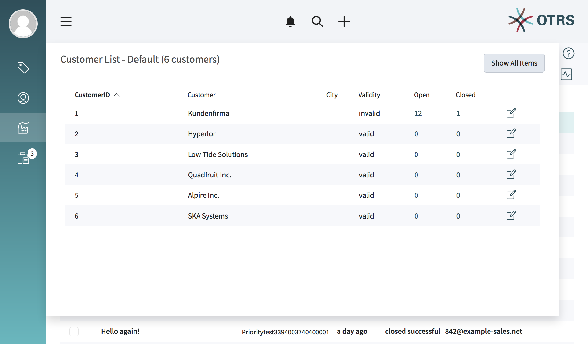

   Business Object List Preview

Column Previews
~~~~~~~~~~~~~~~

TODO

Default Mode
~~~~~~~~~~~~

In default mode new items that have to be shown in the current displayed list are not shown immediately. A notification on the the top of the business object list informs about new data.

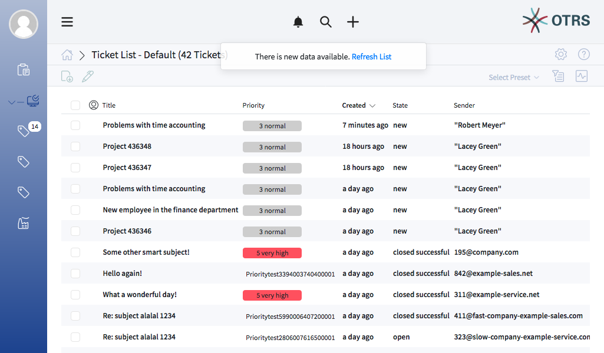

   Notification New List Data

Clicking this notifications refreshes the list and shows the list with updated data. If there are items that can not be displayed in the currently shown list the following happens:

- Write permission still available: The row is highlighted. Editing is possible.
- Read permissions still available: The row is highlighted. Editing is not possible.
- No permissions or object deleted: The row is highlighted, pseudonomized and blurred. Hovering over the row shows an explanation about the reasons.

Pulse Mode
~~~~~~~~~~

For the business object lists of type ticket and knowledge base article is so called pulse mode available.You can activate this mode by clicking the pulse icon in the action bar of business object list.

If this mode is active the business object list will be refreshed periodically including newly added or removed items.

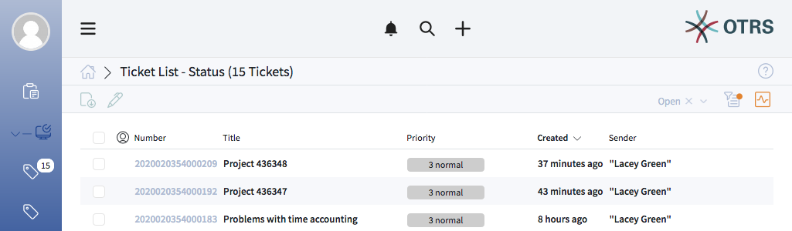

   Active Pulse Mode

.. note::

   It is still possible to perform actions in the list, but it could happen that due to a refresh a relevant popup is closed without confirmation.

Sorting
~~~~~~~

The columns of the business object lists are sortable. The filtering happens on the server. Clicking on any visible and sortable column replaces the current existing sorting criteria and sort the data by the column.

A sorted column is indicated by a small arrow at the according column.

Filtering
~~~~~~~~~

Exporting
~~~~~~~~~

Bulk Action
~~~~~~~~~~~

The bulk action feature allows to perform one or multiple actions for one or multiple items at once. To perform a bulk action for items in a list at least one items need to be selected. Its also possible to select all visible items by clicking the checkbox *Select all visible tickets* at the top of the checkbox column.

The number of selected items is displayed in the header of the list.

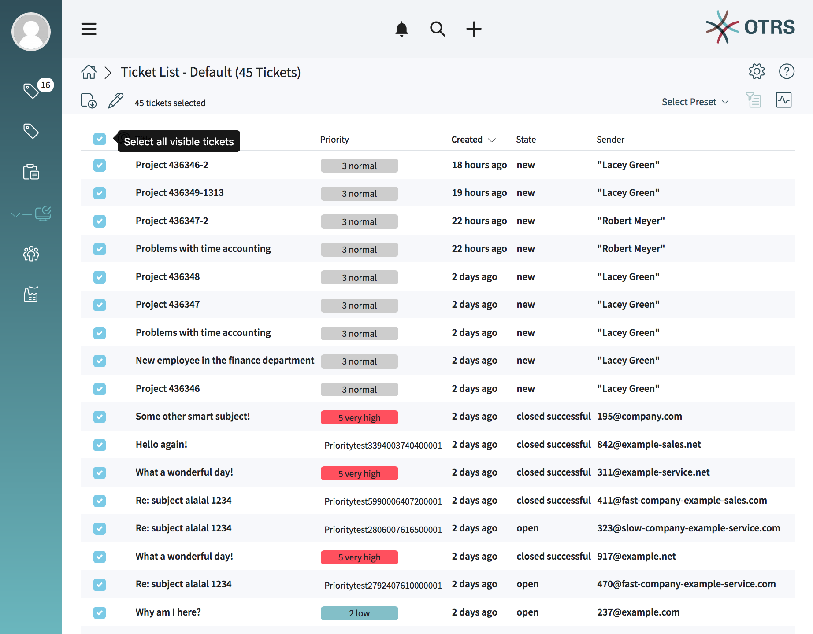

   Bulk Action Select All Items

.. note::
   If the list contains more items as currently could be displayed, the non visible items are not selected.

To select items that are currently not visible:

1. Scroll down the list to display the non visible items
2. Scroll up again
3. Click the pen symbol

Ticket List
-----------

The ticket list shows tickets based on the configuration. This list type supports the pulse mode.

.. note::

   The shown data depends on the permissions.

   Active Ticket List Default

The screen configuration of this list allows to define up to three sorting criteria (multi level sorting).

Clicking an item in the list opens the detail view of the ticket.

The items of the list can be exported.

For actions on more then one item the bulk action supports changes on multiple items.

Ticket List Actions
~~~~~~~~~~~~~~~~~~~

**Change Properties**

In this section the ticket properties:

- State
- Queue
- Owner
- Priority

can be changed for the selected tickets.

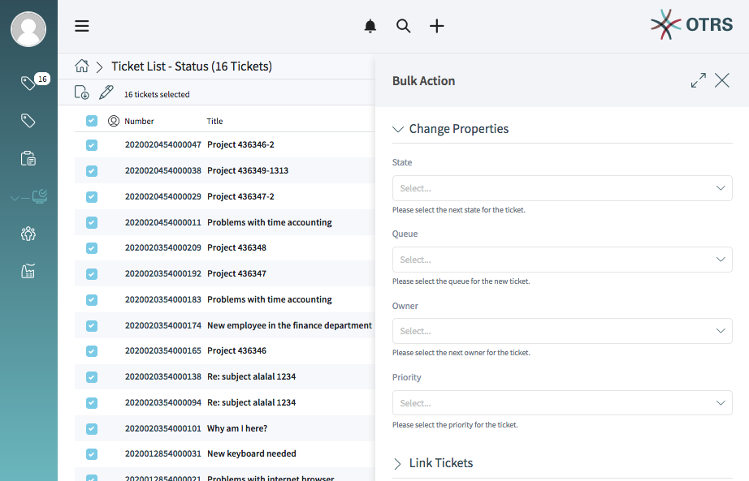

After clicking *Execute Bulk Action* the selected bulk action(s) will be performed. The affected items are highlighted in the ticket list for a short time.

**Link Tickets**

In this section the selected tickets can be linked together or with a parent ticket.

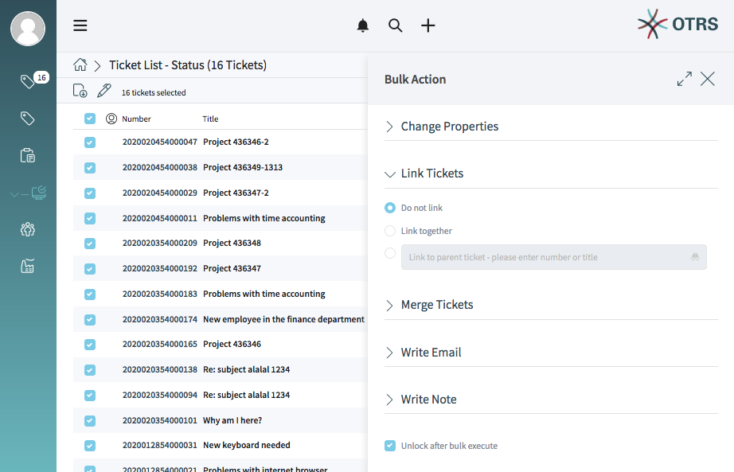

   Bulk Action - Link Tickets

The search field allows to search for a ticket by ticket number or title. Typing at least three numbers or characters opens a list of found items.

Linked tickets are shown in the widget *Linked Tickets* in the ticket detail view.

**Merge Tickets**

In this section the selected tickets can be merged to the oldest one of the selected tickets or to a certain ticket number.

.. warning::
   The merging of tickets can not be undone.

   Bulk Action - Link Tickets

The search field allows to search for a ticket by ticket number or title. Typing at least three numbers or characters opens a list of found items.

**Write Email**

In this section, an e-mail message can be created for the selected tickets.

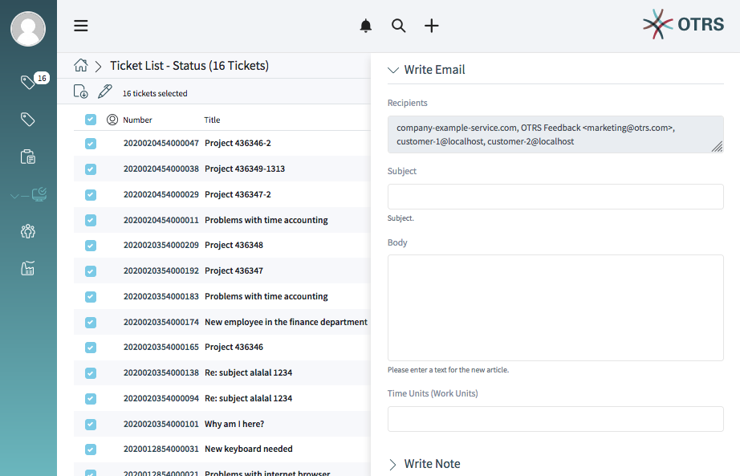

   Bulk Action - Write Email

The recipients field contain all recipients of each single ticket.

**Write Note**

In this section a note can be added to the selected tickets.

   Bulk Action - Link Tickets

If the checkbox *Visible for customer* is checked, the note will be visible for customers in the external interface.

.. note::

   After executing the bulk action the ticket are automatically unlocked. To prevent this, the checkbox *Unlock after bulk execute* needs to be unchecked. In this case the affected tickets remain locked.

Ticket List Bulk Action
~~~~~~~~~~~~~~~~~~~~~~~

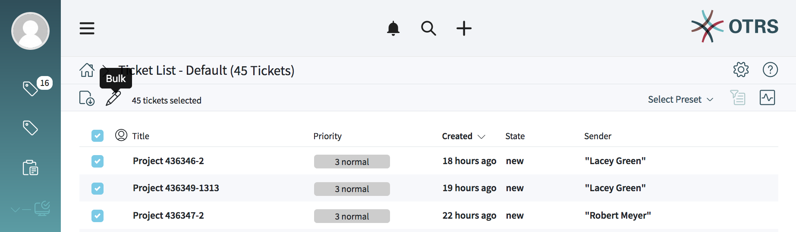

   Ticket List Bulk Action Symbol

For ticket lists the pen symbol at the top of the list opens the screen for the bulk action.

Performing a bulk action for tickets means, that these tickets will be automatically locked to the agent while performing the bulk action.

This needs to be confirmed first by clicking *Lock and Continue*.

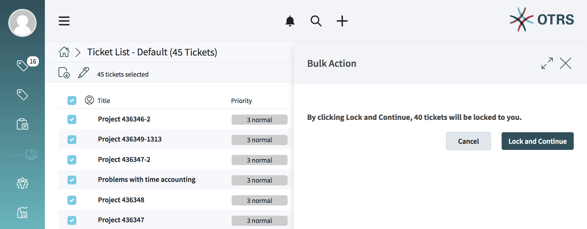

   Ticket List Bulk Action Lock Confirmation

After confirmation the options for the bulk action are shown.

.. note::

   If there are missing permissions for locking tickets a message is shown where the items are listed that can not be locked. It is possible to continue with the bulk action, but the listed items will not be affected.

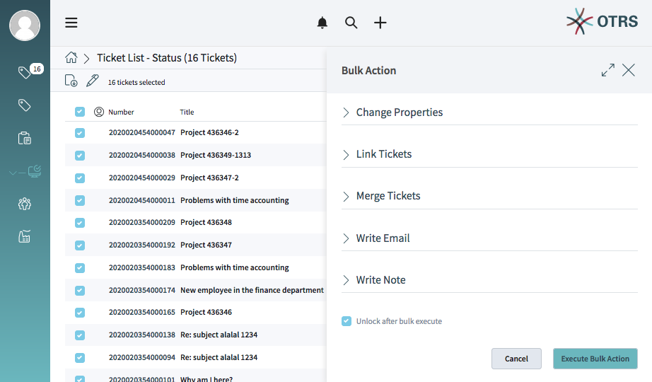

Watching Tickets
~~~~~~~~~~~~~~~~

   TODO

   .. note::

      The ticket watch feature is deactivated by default and needs to be activated first by a system administrator in order to use it.

Knowledge Base Article List
---------------------------

The knowledge base article list shows entries form the knowledge base. This list type supports the pulse mode.

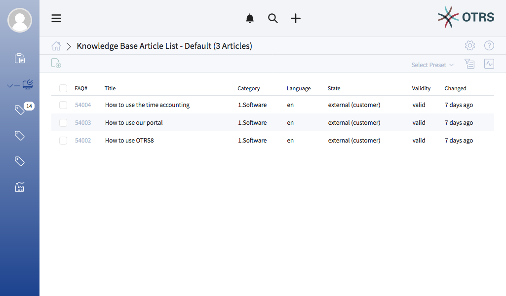

   Knowledge Base Article List Default

The items of the list can be exported. Clicking an item in the list opens the detail view of the knowledge base article.

Knowledgebase Article List Actions
~~~~~~~~~~~~~~~~~~~~~~~~~~~~~~~~~~

Web Notification List
---------------------

The web notification list shows notifications about:

- Tickets
- Appointments

The web notification list type supports the pulse mode.

As bulk actions are the actions *Mark selected as Read* and *Delete Selected* directly accessible via the according buttons at the top of the list.

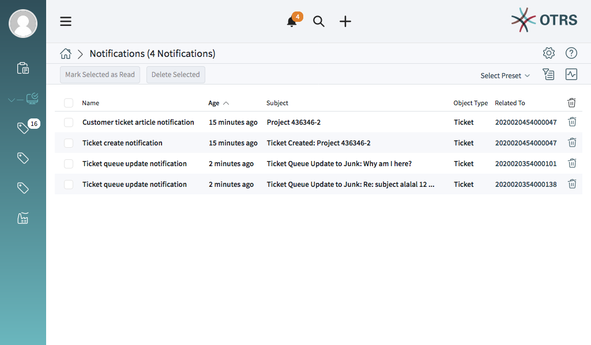

   Web Notification List Default

.. note::

   The web notification view must be activated for each notification via administrator interface.

Unread notifications are displayed with a number on the bell symbol at the header area of agent interface. Clicking on the bell symbol opens a popup where the latest five notifications are displayed.

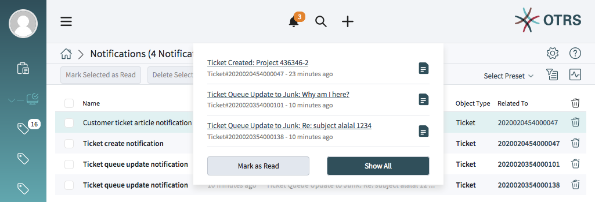

   Web Notification Popup

Clicking the button *Show all* opens the web notification list. Clicking the button *Mark as Read* marks all notifications as read.

Clicking the document symbol opens the notification list and the notification details in a popup. This action also sets the notification to read

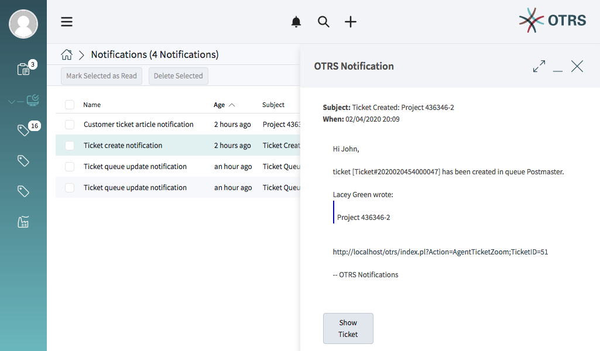

   Web Notification List - Detail Popup

Clicking on the title of the notification opens the detail view

TODO: Appointment Notifications

Customer List
-------------

The customer list shows customers and informations about this customers, i.e. how many open tickets or how many closed tickets.

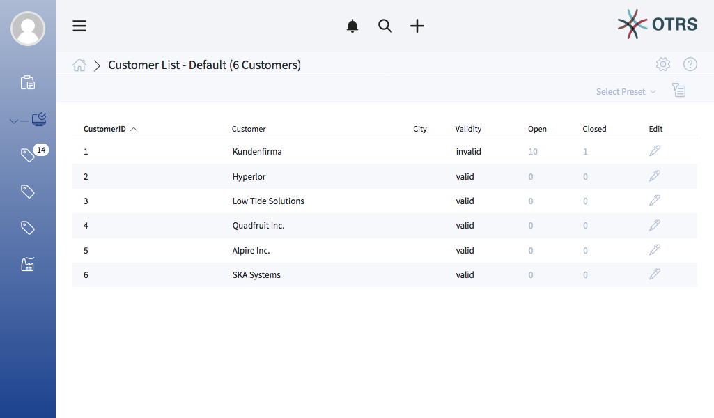

   Customer List Default

Clicking the pencil symbol in the column *Edit* opens the view for editing the customer details.

Customer User List
------------------

The customer list shows customers users and informations about the customer users, i.e. how many open tickets or how many closed tickets.

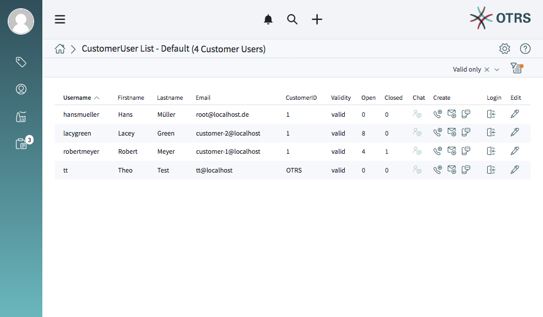

   Customer User List Default

A special column for this list is the column *Create*. Clicking on the symbols in this column instantly opens the ticket create view.

Another special column for this list is the column *Login*. Clicking on this symbol leads to the login section of the external interface.

Clicking the pencil symbol in the column *Edit* opens the view for editing the customer details.
