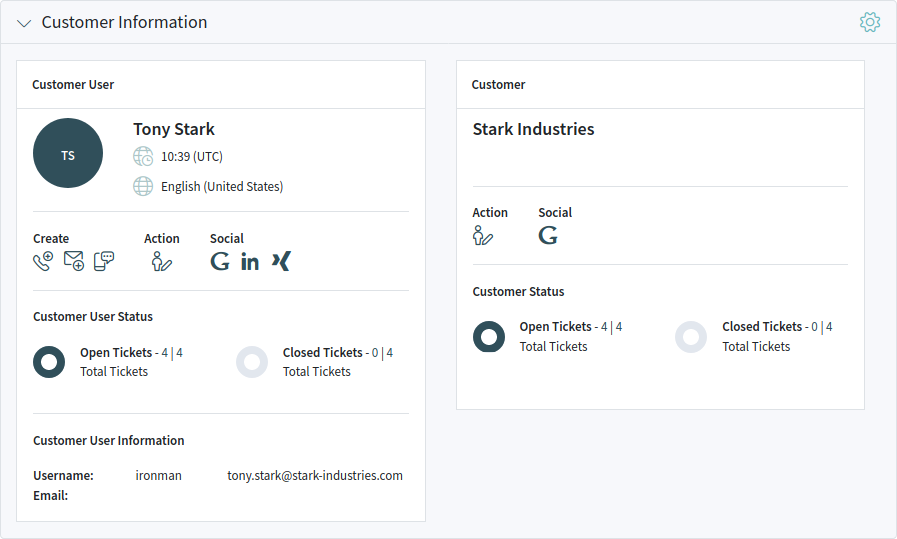
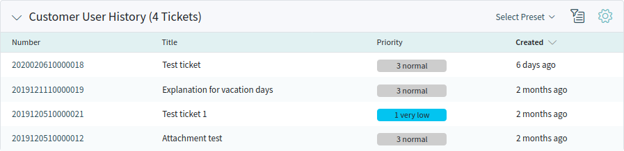

Communication
=============

Agents can communicate with customer users via email, phone or SMS, and agents can communicate with other agents via note. Additionally, it is possible to start processes, which can affect both agents and customer users.

The communication is managed with using tickets. This means, **OTRS** will convert any type of communications into tickets, and it will add the messages as articles to the ticket.

Create Request
--------------

When agents start the communication, they can create *email tickets*, *phone tickets* or *SMS tickets*. All the communication result a ticket, and the first message is added to the ticket as an article.

Email Ticket
   Email ticket is used to send an email to the customer user or to other recipients, when the ticket is created.

Phone Ticket
   Phone ticket is used to record the information during a phone call with the customer user. When the ticket is created, no email will be sent to the customer user. The ticket is treated as it was originally created by the customer user.

Process Ticket
   Creating a process ticket will start a defined process. The agents and the customer users have to follow the steps, that is provided by the process. Any message created during a process ticket will create new articles to this ticket.

SMS Ticket
   SMS ticket is used create a ticket and send the first article via SMS to the customer user. SMS ticket has a limited body to fit the text to the restriction of the SMS.

The following sections explain, how can an agent create a new request in the agent interface for the customer user. Creating email tickets, phone tickets and SMS ticket are almost the same, so the following sections will describe the ticket creation in a general manner.

Properties Widget
~~~~~~~~~~~~~~~~~

This widget is used to create the request for the customer user. This widget consists of four sections: *Customer*, *Assignment*, *Service Level Management* and *Communication*.

Customer
   In this section can be selected the customer user, who the new ticket is created for. The customer user can be selected by typing the name into the field, or by using the customer address book next to the field. Using the wildcard character \* is possible to search for the customer user.

   .. figure:: images/create-request-properties-customer.png
      :alt: Select Customer User

      Select Customer User

   The *Customer* field is read only, and it will be auto-populated with the customer of the selected customer user.

Assignment
   In this section can be selected the *Queue* and the *Owner* of the ticket. The queue selection is mandatory.

   .. figure:: images/create-request-properties-assignment.png
      :alt: Queue And Owner Selection

      Queue And Owner Selection

Service Level Management
   In this section can be selected the priority and the next ticket state.

   .. figure:: images/create-request-properties-sla.png
      :alt: Priority And State Selection

      Priority And State Selection

Communication
   In this section can be written the message like in an email client.

   .. figure:: images/create-request-properties-communication.png
      :alt: Write The Message

      Write The Message

   This section is different for phone tickets and email tickets.

   For phone tickets, the *From* field is available and mandatory, because a phone ticket is treated as it is created by the customer user. The *To* field is the queue selected in the previous section.

   For email tickets, this section works a normal email client. It has *To*, *Cc* and *Bcc* fields for the recipients.

   It is possible to select a text template for the new ticket. The content of the template will overwrite the existing texts.

   The *Subject*, *Body*, *Attachments* and *Time Units* fields are the same for both the phone ticket and the email ticket.

   *Signature* is only applied for the email tickets.

Customer Information Widget
~~~~~~~~~~~~~~~~~~~~~~~~~~~

This widget displays detailed information about the selected customer user and about its customer.

   Customer Information Widget

Customer User History Widget
~~~~~~~~~~~~~~~~~~~~~~~~~~~~

This widget shows the tickets for the customer user selected above.

   Customer User History Widget

Customer History Widget
~~~~~~~~~~~~~~~~~~~~~~~

This widget shows the tickets for the customer selected above.

   Customer History Widget
