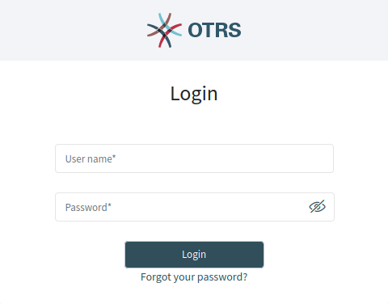
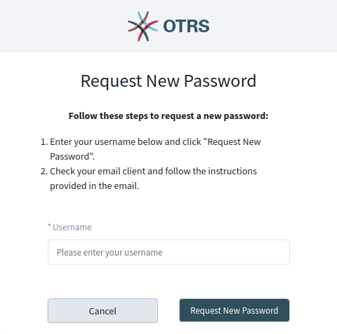
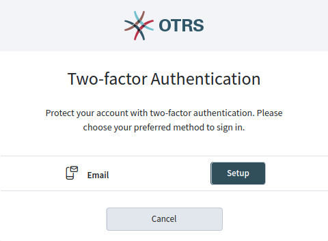
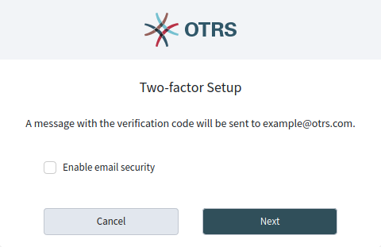
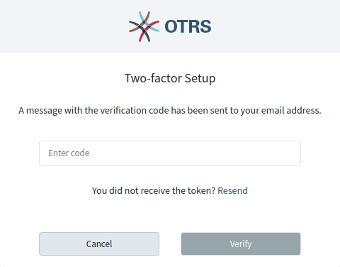

Login to Agent Interface
========================

The agent interface is available at the following location.

.. code-block:: none

   https://<OTRS_HOST>/agent

.. note::

   You have to replace ``<OTRS_HOST>`` with your domain.

You need an agent account to be able to use OTRS. If you have no account yet, please contact your administrator.

   Agent Login Screen

If you forget your password, click on the *Forgot your password?* link, and follow the instructions there.

   Request New Password Screen

For security reason, the two-factor authentication have to be setup for each agent when they login at the first time. Click on the *Setup* button to setup this security feature.

   Two-factor Authentication

The two-factor token will be sent to the email address of the agent.

Selecting the *Enable email secority* option activates an opportunistic encryption of the sent email containing the two-factor token. This feature will work only if either PGP or S/MIME subsystem is activated, and there is a public key or certificate available for the agent’s target email address. Otherwise the email will be sent in plain text.

   Two-factor Setup for Email

Check your mailbox and find the email containing the two-factor token. The token consists of some deicimal letters. Type the token into the next window.

   Two-factor Setup Email Verification

After a successful login, the agent dashboard will be displayed.

.. figure:: images/dashboard-collapsed.png
   :alt: Agent Dashboard

   Agent Dashboard

Congratulations! You are now able to use the **OTRS** system.
