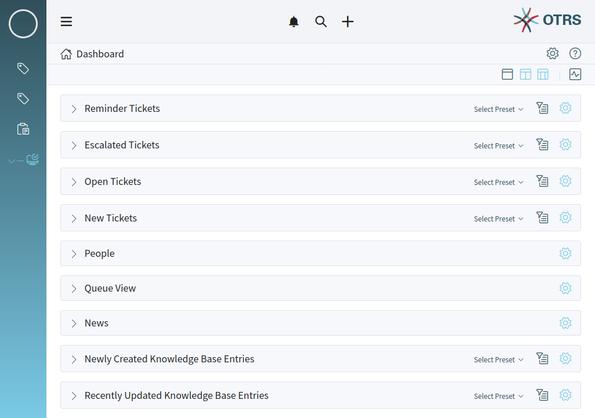
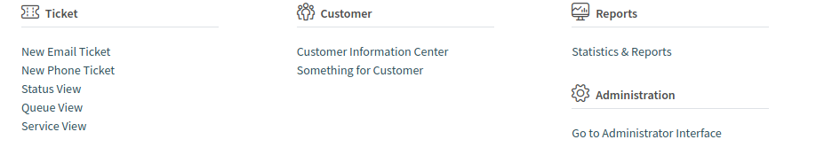
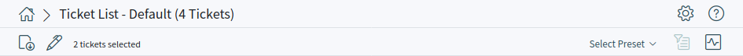
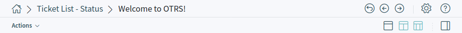
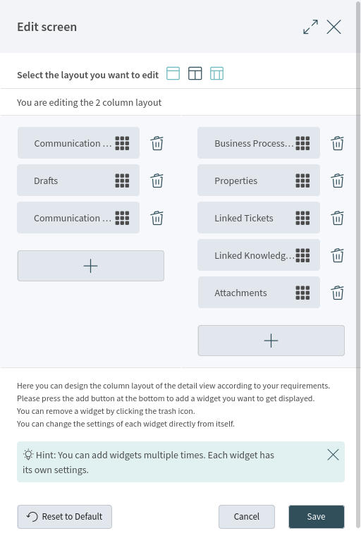
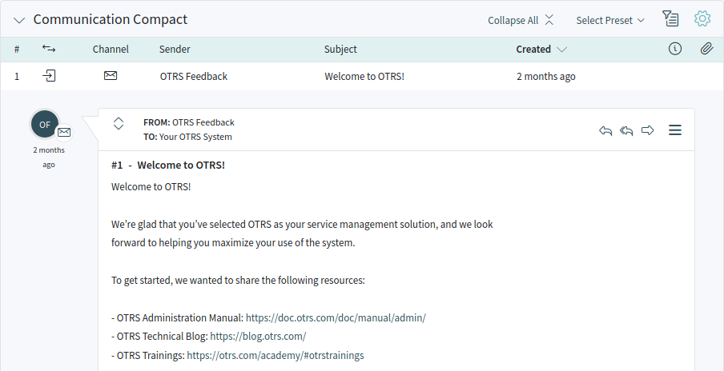
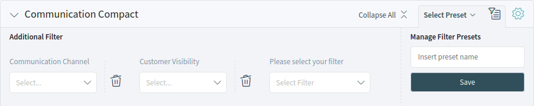
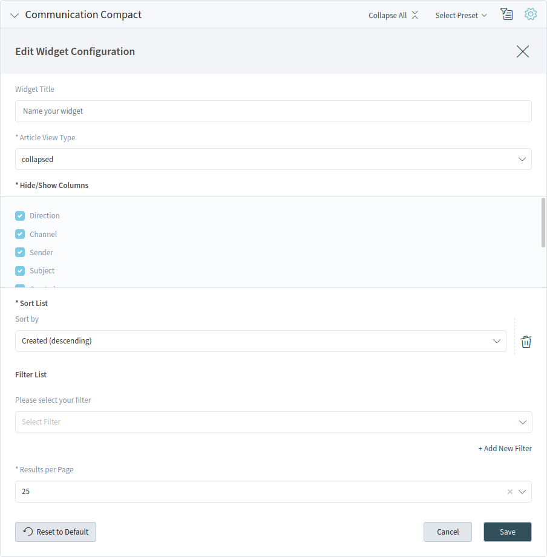

Navigation
==========

The agent interface acts as a dashboard for the agents. This is a complex screen where most of the actions can be accessible.

   Agent Dashboard

On the left side of the screen there is sidebar called *Organizer*. The organizer sidebar contains the personal settings of the current agent and some shortcuts. This organizer sidebar is hidden by default when using mobile mode.

The screen has a header bar with the most important menus, including the main menu, the notification menu, the search field and the action menus.

Below this header the breadcrumb bar is located, which helps to easily identify where the agent currently is and can display toolbar or actions. The right side of this breadcrumb bar contains the screen configuration and the help.

The content area of the screen can display a :doc:`dashboard`, :doc:`business-object-lists` or :doc:`business-object-detail-views`. These screens can contain a list of :doc:`business-objects` or multiple widgets. The number of the widgets and the content of the widgets depend on the screen what the agent currently sees. Every widget can be customized in its widget configuration.

Personal Settings
-----------------

The :doc:`personal-settings` contain general settings for the agent account, security possibilities to protect this account using password and two-factor authentication, notification settings and an editor to customize the organizer.

Organizer
---------

On the left side of the screen there is sidebar called *Organizer*. This sidebar contains shortcuts to business object lists. The items of the sidebar can be customize in the :doc:`personal-settings`.

Main Menu
---------

The main menu contains links for the most important screens of the system.

   Main Menu

Action Menus
------------

The header bar contains the notification menu, the search field and the action menus.

   Action Menu

Notifications
   Clicking on he first bell icon will show the currently unread notifications. There is a button *Show All* to open the notification list and to select any previous notification.

Search
   Clicking on the second magnification glass icon will display a search bar to search for everything on the system.

Create new
   Clicking on the third plus icon will open a menu to create new business objects.

Breadcrumb Bar
--------------

The breadcrumb bar helps the agents to easily navigate in the system. The breadcrumb bar consists of tho rows, and both rows have icons in its both sides.

   Breadcrumb Bar For Business Object List

   Breadcrumb Bar For Business Object Detail View

The first row of the breadcrumb bar contains the breadcrumb itself, which acts as a path indicating the current place where the agent is. On the right side of this row the screen configuration and the help are located. This part of the breadcrumb bar can contain buttons for navigation between business objects and go back to the business object list.

The second row of the breadcrumb bar can be different for business object lists and business object detail views.

- For business object lists, the second row of the breadcrumb bar can contain export and bulk actions in the left side, and filter presets, filter possibilities and pulse mode. This row can contain an action menu regarding to the business object, the column layouts and a button to show or hide the sidebar in the business object detail view.
- For business object detail views, the second row of the breadcrumb bar can contain an action menu regarding to the business object, the column layouts and a button to show or hide the sidebar in the business object detail view.

These features and actions are displayed only, if the selected business object list or business object has such a menu.

Screen Configuration
~~~~~~~~~~~~~~~~~~~~

The screen configuration is accessible via the gear icon. Every screen has such a menu, and the content of this setting depends on the screen.

   Screen Configuration For Two-column Layout

The same configuration screen can be used for all column layouts.

Select the layout you want to edit in the top of this screen. Next, the widgets of the current screen can be added, removed or rearranged. Any widget can be added multiple times. Each widget has its own settings.

Get Help
~~~~~~~~

TODO: This feature is not implemented yet.

Column Layouts
~~~~~~~~~~~~~~

For large screens, different column layouts can be selected. On small screens or in mobile view only the one column layout is usable.

The position of the widgets can be customize in the screen configuration.

Sidebar
~~~~~~~

TODO: This feature is not implemented yet.

Widgets
-------

The content area of each screen is used to display the widgets in one, two or three column layout. The number and type of the widgets depend on the displayed business object list or business object detail view and can be customize in the screen configuration.

   Widget Overview

Each widget has a header with the name of the widget and a chevron icon to collapse or expand the widget itself. There is an other *Expand All* or *Collapse All* button in the header to expand or collapse the content of the widget. The *Select Preset* option shows the configured and named filter from the *Filter* section. Finally, the widget configuration is located in the right side of the header.

The content of a widget can be a table or a content area, or can be consisted of multiple content cards.

.. _widget-filter:

Widget Filter
~~~~~~~~~~~~~

Most of the widgets have a filter possibility to narrow the results displayed in the widget content. The filter options can be showed or hidden with the filter icon.

   Widget Filter

The number of the filter possibilities depends on the widget. There are filters with text input field, and some other filters can have a drop-down list to select only one or multiple options.

The filters can be removed with the trash icon next to the field.

It is possible to enter a name to the configured filter setup and save this as a preset. The saved presets can be selected in the header of the widget.

.. note::

   The filter for the business object list works the same manner.

.. _widget-configuration:

Widget Configuration
~~~~~~~~~~~~~~~~~~~~

The widget configuration is accessible via the gear icon. Every widget has such a menu, and the content of this setting depends on the widget.

   Widget Configuration

The following configuration options can be available for the widgets. The configuration options depend on the widget. The fields marked with an asterisk are mandatory.

Widget Title
   Here can be changed the default name of the widget. If a new name is entered, this name will be displayed in the header of the widget.

Hide/Show Columns
   In this list can be selected, which columns should be visible in the widget, if the widget content is displayed in a table form.

Show Lists
   In this list can be selected, which cards should be visible in the widget, if the widget content is displayed as content cards.

Sort List
   Here can be selected some order criteria and the sorting orders for the content of the widget.

   Some widgets supports only one sorting criterion, while other widgets can support up to three criteria. If more criteria is available, you can add a new one with the *+ Add New Sorting* link until the sorting limit is reached.

Filter List
   Here can be selected some filter criteria for the content of the widget.

   Any available filter options can be selected at the same time. You can add a new one with the *+ Add New Filter* link.

Results per Page
   Here can be selected, how many entries should be visible in the list by default.
