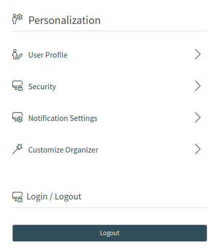

Personal Settings
=================

The personal settings can be set via the avatar image in the organizer sidebar.

   Personal Settings

Every menu item has a search box in the top of the widget to search for a specific setting.

User Profile
------------

This menu item contains general settings for the agent account.

Avatar
   Here can be changed the image used as avatar image. It is possible to upload an avatar image directly or you have to register your email address on `Gravatar <https://www.gravatar.com/>`__ to use this feature. Otherwise the first letters of first name and last name will be displayed.

Language
   Here can be selected the language for the user interface.

   Only those languages are listed by default, for which the translation completeness is more than 95%. To see all available languages, click on the globe icon next to the drop-down list.

   .. seealso::

      Translation status of incomplete languages are low, but you can help to improve the translation. See the `developer manual <https://doc.otrs.com/doc/manual/developer/8.0/en/content/contributing/translate.html>`__ for more information about translating **OTRS**.

Screen After New Ticket
   Here can be selected, which screen should be shown after a new ticket has been created.

Style
   Here can be selected, which style should be used for the user interface. For some styles the *Variant* is also can be chosen.

Time Zone
   Here can be selected the time zone used by the user interface to display time values. Just start typing the name of capital city of your current location.

Date Time Format
   Here can be selected the displayed format of the time values.

Out of Office Time
   Use the calendar entries to set the start and the end date for your out of office days. Multiple entries can be added here.

When you have finished the settings, press the *Save* button.

Security
--------

This menu item contains the settings to protect the agent account.

Change Password
   Here can be change the current password of the agent by entering the old and the new passwords.

Two-factor Authentication
   Here can be added and additional authentication method, which is called two-factor authentication. The two-factor authentication acts as a second password to protect the account. While the normal password is something that the agent have to know, the two-factor token is something that the agent have to own. This means, if an agent enters the username and the password, then a token will be sent to they via email or SMS, or the agent can use a pre-configured authenticator application.

   To set a two-factor authentication method:

   1. Click on the *Setup* button.
   2. Enter your current password.
   3. Follow the instructions you see on the screen.

Notification Settings
---------------------

This menu item contains the settings regarding to notifications.

My Queues
   Here can be selected some queues as preferred queues.

My Services
   Here can be selected some services as preferred services.

   .. seealso::

      System configuration ``Ticket::Service`` needs to be activated to use this feature.

Ticket Notifications
   In this widget can be selected the methods used for any kind of ticket notifications.

   .. figure:: images/personal-settings-notification-ticket-notification.png
      :alt: Ticket Notifications Widget

      Ticket Notifications Widget

   The possible methods are *Email*, *Web View* or *SMS*.

Appointment Notifications
   In this widget can be selected the methods used for any kind of appointment notifications.

   .. figure:: images/personal-settings-notification-appointment-notification.png
      :alt: Appointment Notifications Widget

      Appointment Notifications Widget

   The possible methods are *Email*, *Web View* or *SMS*.

Customize Organizer
-------------------

This menu item contains the possibilities to customize the organizer sidebar.

The organizer sidebar displays the items that are currently added to the organizer. It is possible to add new items or edit the existing items. An item can be added more than one. This is usefull, if the same item is needed but with different configuration.

To add an item to the organizer sidebar:

1. Click on the *+* icon to add a new item.
2. Toggle the icon chooser to set a different icon.
3. Enter a name for the new item.
4. Select the item type from the list.
5. Click on the *Customize* option to customize the item.

To edit an item in the organizer sidebar:

1. Select an item from the sidebar.
2. Change the icon and the name of the item, if needed.
3. Click on the *Customize* option to customize the item.

The customizitaion possibilities of an item is depend on the item type. In the customization screen, it is possible to hide and show columns for the item list, select a sorting criteria and the sorting orders, define filters for the elements, as well as set the number of results per page.

Every organizer item can be moved up and down to change its position in the sidebar. They can can be cloned to make the configuration easier, and of course, they can be deleted as well.

Login / Logout
--------------

This section is used to logout from the system. Just click on the *Logout* button to exit.
