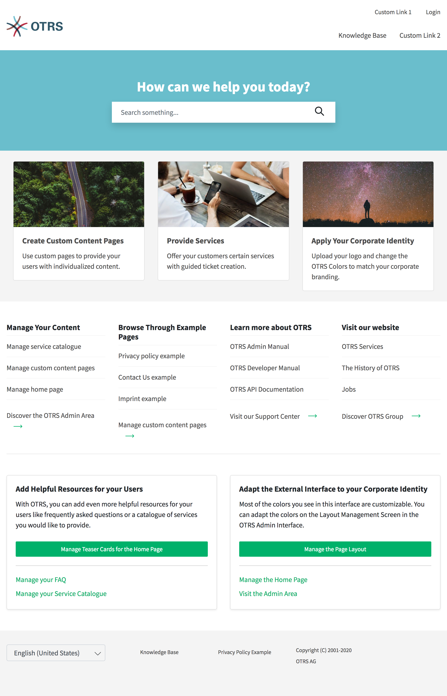
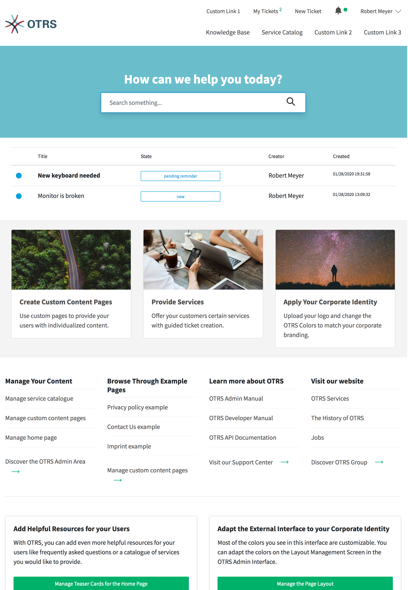

Home Page
=========

   Public Homepage

   Homepage for Logged in User

**Meta Navigation Bar**

The meta navigation bar contains the login link for customer users. It can contain other custom links depending on the settings made by the system administrator.

**Primary Navigation Bar**

The primary navigation bar contains a link to the knowledge base and can contain other custom links depending on the settings made by the system administrator.

**Main Section**

The main section section contains the search field and can be used to display informations or a welcome message.

**Link List**

The link list section can be used to show boxes with a collection of useful links.

**Image Teaser**

The image teaser section can be used to show boxes with pictures and links.

**Content Card**

The content card section can be used to show boxes with a teaser text and links to further informations.

**Footer Bar**

The footer bar section contains a dropdown menu for selecting the language of the external interface.
In the right corner is the Chat icon. Clicking on this icon will open the Chat function of the external interface.

.. note::

   The picture shows only initial state of the software and examples.
   The content of your external interface may vary depending on the settings made by the system administrator.
