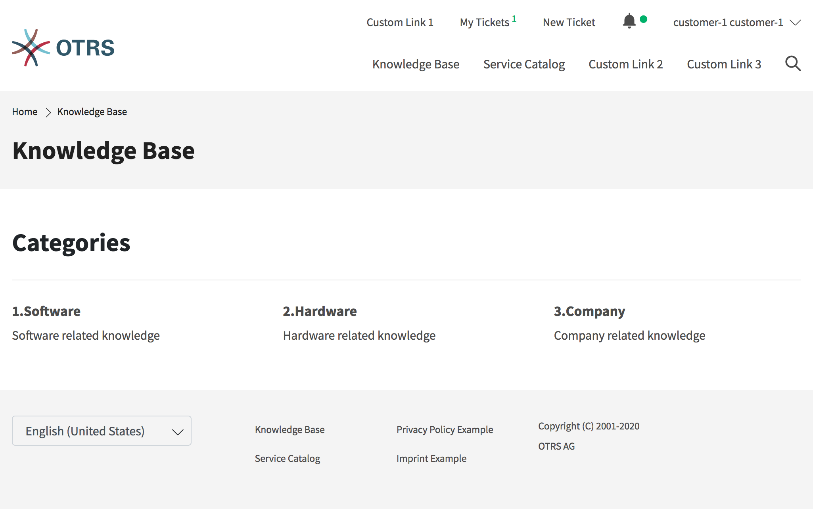
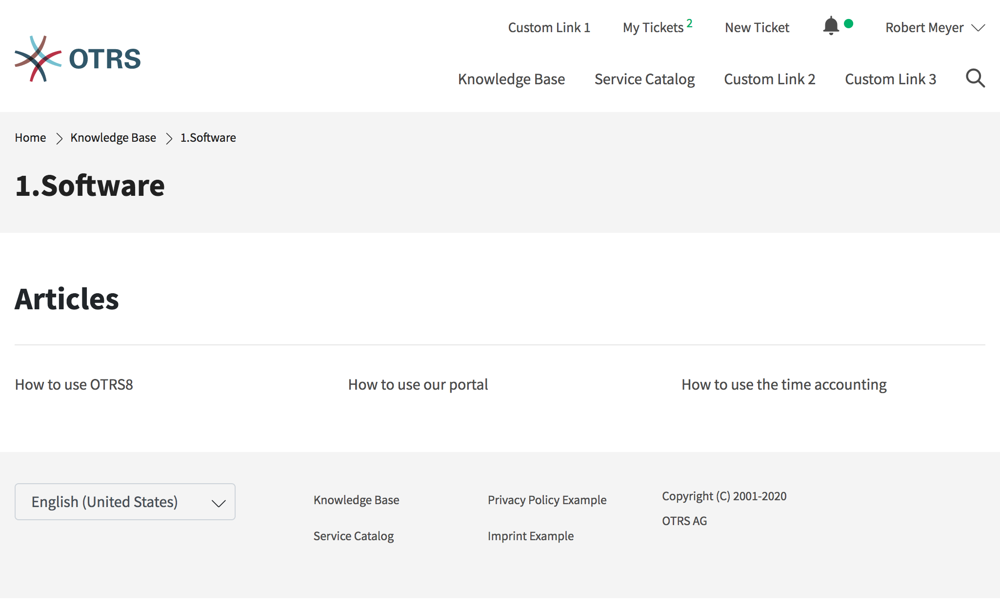

Knowledge Base
==============

The knowledge base area can be used to display knowledge base articles for customers and customer users. The knowledge base articles can be grouped in categories.

.. note::

   To display a knowledge base article in the external interface the state of the article needs to be External(customer) or Public(all). If the state is set to External(customer) the knowledge base article will be shown only for logged in customer users. If the state is set to Public(all) the knowledge base article will be also visible for not logged in users.

   Knowledge Base Categories

Clicking on an article title opens the detail view of the article.

   Knowledge Base Article

The detail view of the article can contain the sections:

- Symptom
- Problem
- Solution
- Comment
- Rating

.. note::

   The sections *Symptom*, *Problem*, *Solution* and *Comment* are only displayed if the corresponding field is filled with text when the article is created.

At the end of the article the customer users can vote for the article. The results of the votings are displayed in the ###LINK detail view (agent interface) of a knowledge base article.
