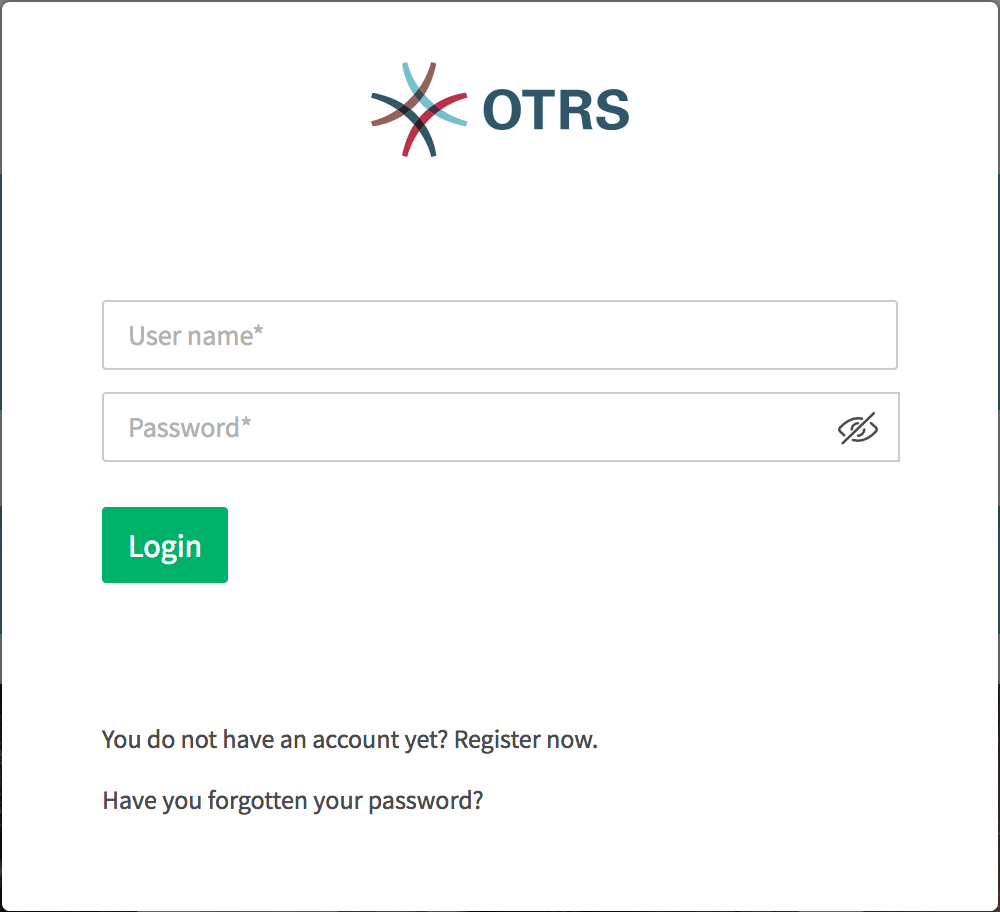
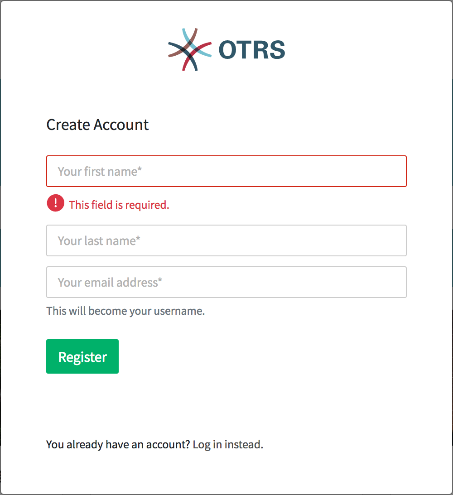
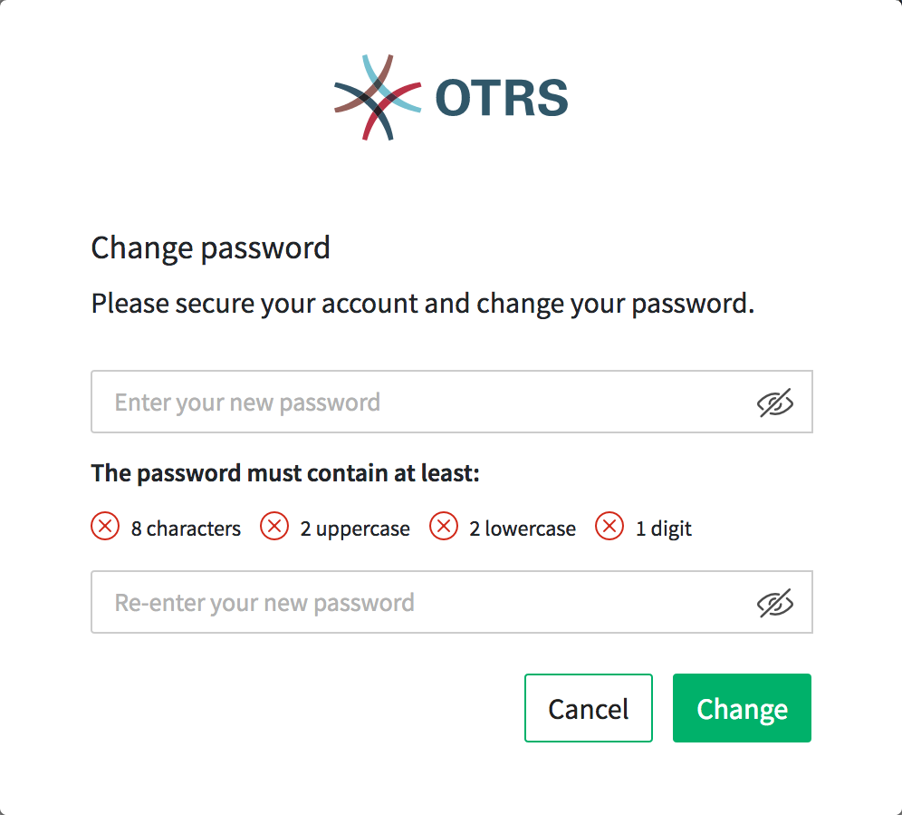
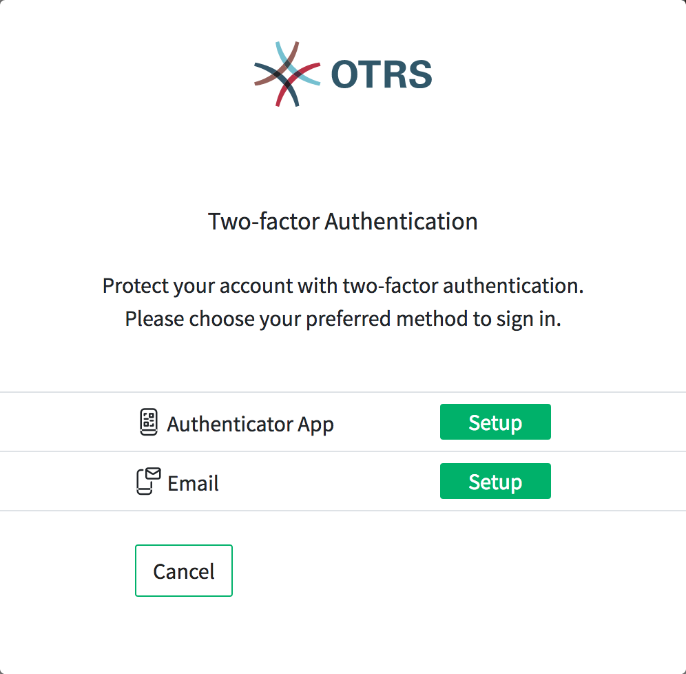

Login
=====

The external interface is accessible via the URL:

::

   https://<OTRS_HOST>/external

.. note::

   You have to replace ``<OTRS_HOST>`` with your domain.

You need an customer account to be able to use OTRS. If you have no account yet, please contact your administrator or follow the steps for creating an account described in the section below.

1. Fill in the required fields.
2. Click the Login button.

   Login

Creating An Account
-------------------

1. Click on the *Login* button at the upper right corner.
2. Click the link *Register now*.
3. Fill in the fields.
4. Click on the *Register* button.

   Create Account

The login informations have been sent to the given email address. Log in with the password sent in the e-mail. After sending the data you will be asked to change the password.

Change Password
---------------

   Change Password

1. Fill in the fields.
2. Click on *Login* button.   

After sending the data you will be asked to set up the two-factor authentication.

Two-factor Authentication
-------------------------

   Two-factor Authentication

1. Choose your perferred authentication method.
2. Click on the *Next* button.

.. note::
   
   If you select email as the authentication method, you have the option to enable e-mail security. This means that the email is encrypted and signed when the data is sent. 

Depending on the chosen authentication method the code will be displayed in the app or in the email.

1. Enter the code in the field.
2. Click on the *Verify* button.
