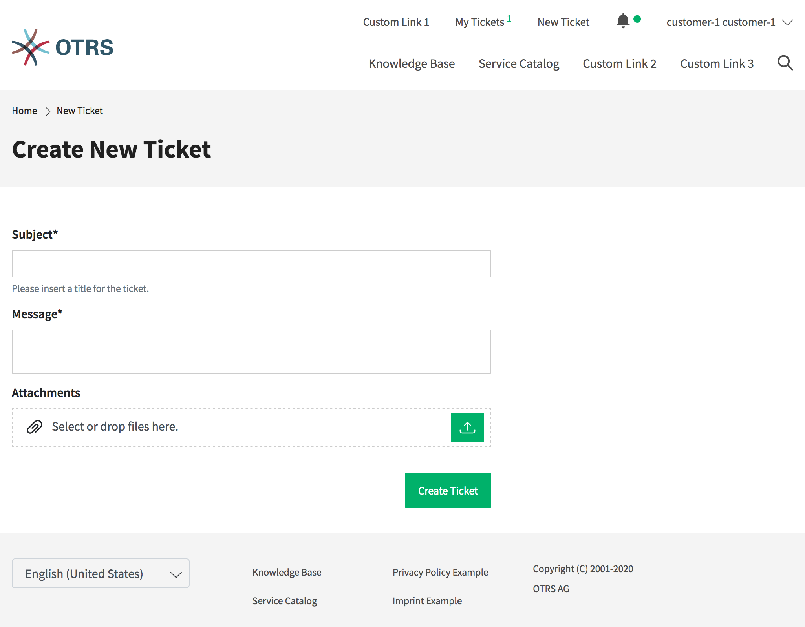

Create New Tickets
==================

In this view a customer user can create new tickets. The fields *Subject* and *Message* are mandatory fields. The field *Attachment* can be used optional for adding attachments to the ticket.

   Create New Ticket

The text editor of the *Message* field offers the following options:

- Marking text as bold or italic
- Adding links
- Adding a numbered or a bulleted list
- Text alignment
- Inserting block quotes
- Inserting tables
- Inserting pictures

After creating the ticket and clicking the *Submit* button, the customer user is taken to the :doc:`ticket-list` view. The created ticket is displayed in the list view next to any other already created tickets.

After submitting the data the ticket appears as new ticket in the views of the agent interface.
