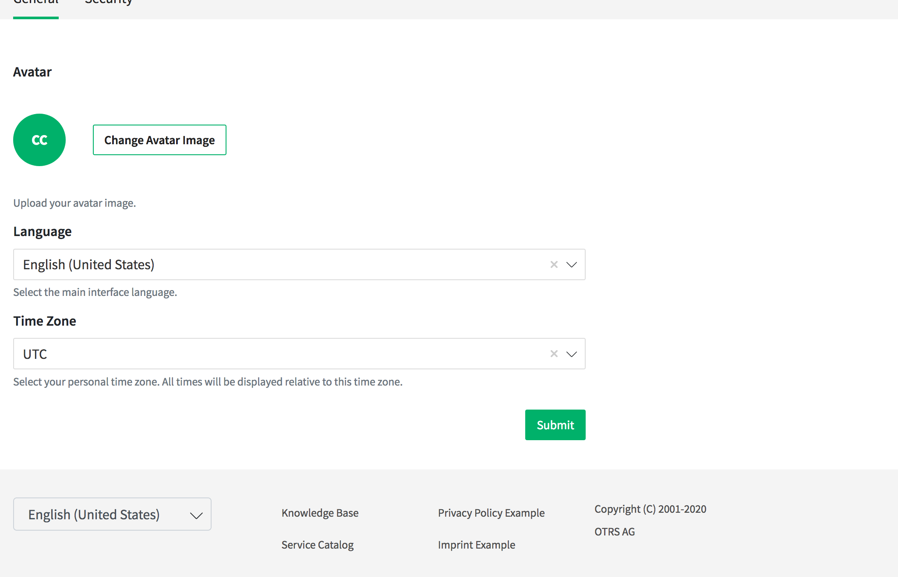
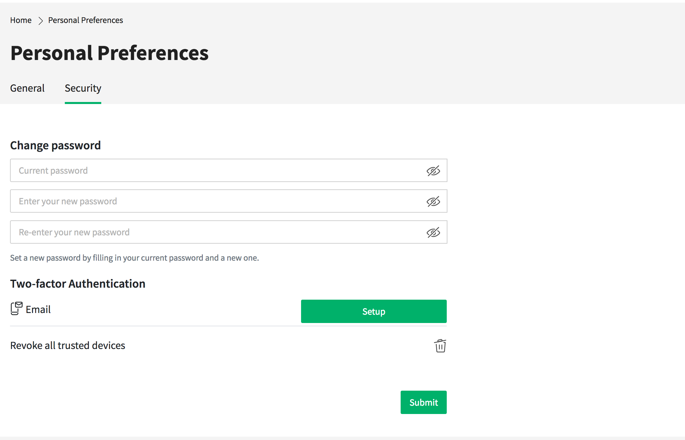

Personal Preferences
====================

The personal preferences view contains the sections *General* and *Security*.

General
-------

   Personal Preferences - General

In the section *General* the customer user can change his avatar image, the language of the external interface and the preferred time zone.

Security
--------

   Personal Preferences - Security

In the section *Security* the customer user can change his password and the settings for the two-factor authentication.
