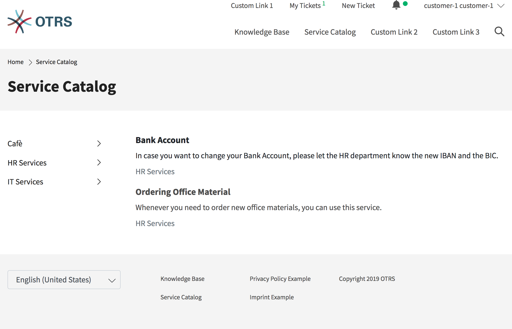
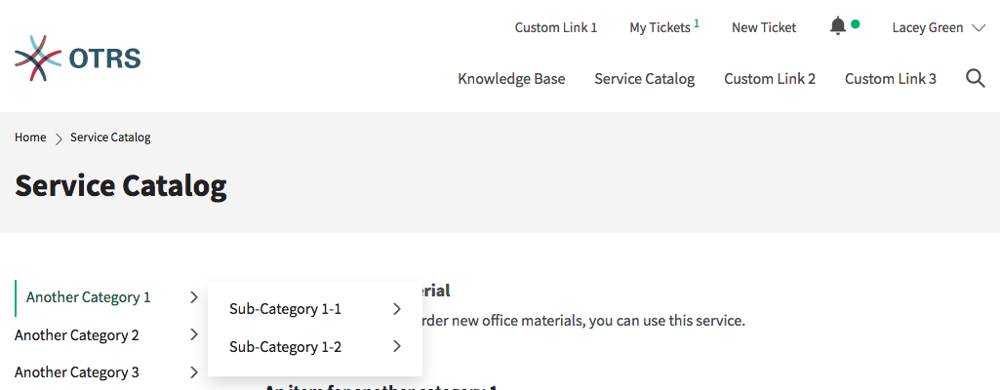

Service Catalog
===============

The service catalog section can be used to display service catalog information and categorize the information. The service catalog categories are shown in alphabetical order at the left side of the view.

In addition to plain text, the service catalog entries can also contain links to other pages. For entries with links, item title and text are highlighted when the customer user hovers over the entry. If the customer users clicks the hovered entry he will guided to the linked page.

   Service Catalog

If in a category subcategories are defined, the subcategories are shown if the customer user hovers over an category.

   Catalog with Subcategories

.. note::

   If there are items that are not assigned to a category, these items are displayed initially when the view is called up. If all items are assigned to categories, the items that have been clicked on the most are displayed first.
