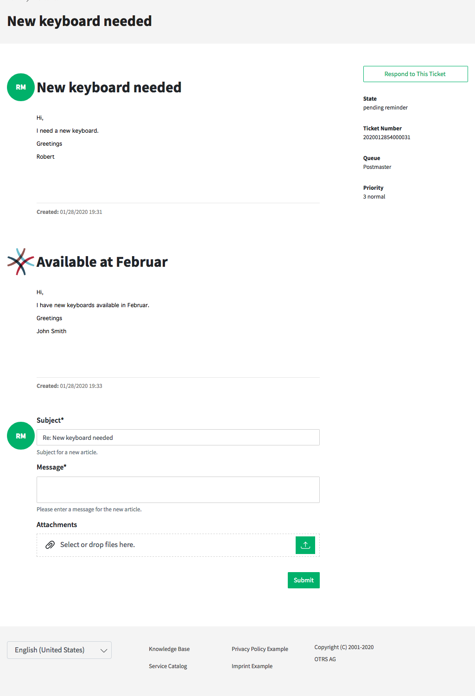

Ticket Detail View
==================

The ticket detail view displays the complete communication in the ticket.

   Ticket Detail View

The articles are displayed in a list that by default starts with the first article. At the right side dispalys per default the following ticket informations:

- State
- Ticket number
- Queue
- Priority

At the end of the article list is the section for writing a response to the ticket. The button *Respond to This Ticket* at the right side scrolls the view directly to the response section.
