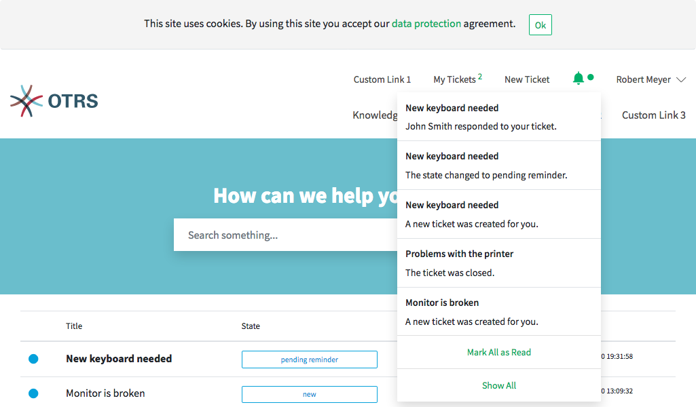

Ticket Notifications
====================

The ticket notifications inform the logged in customer user about:

- Newly created tickets of the customer user
- Responses from agents to tickets of the customer users
- State changes of a ticket

   Notification Screen on Hover

The bell icon in the meta navigation bar informs about new unread ticket notifications. If the bell icon has an additional green circle, then there are new unread notifications. When the customer user hovers over the icon, a short overview of the last five ticket notifications is displayed.

The customer user can mark them as read or open the view My Notifications.

My Notifications
   This view displays all notifications with their date and time, independently of whether they are marked as read or unread. Unread notifications have bold titles. When the customer user hovers the mouse over an entry in the list, the entry is highlighted.

   .. figure:: images/my-notifications-all.png
      :alt: My Notifications All

      My Notifications - All

If the customer user then clicks on an entry with the mouse, the corresponding ticket is displayed in the :doc:`ticket-detailview`. If the customer user clicks the blue circle near the titles he can set the ticket notifications to read or unread.
